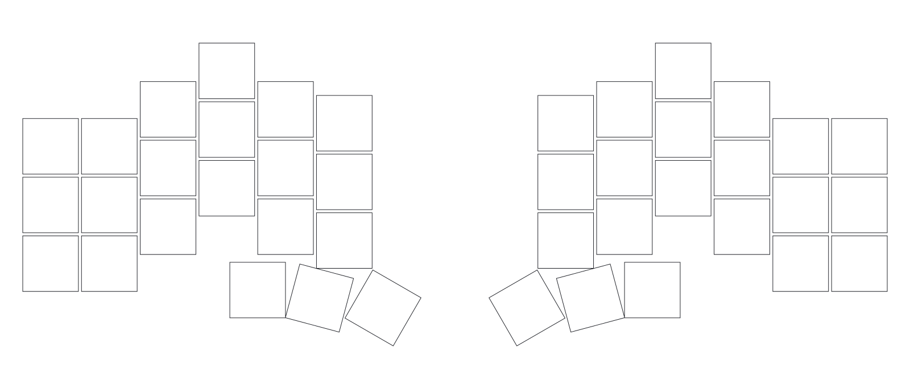

<div align="center">

# tsunde 「つなで」

<picture>
  <source media="(prefers-color-scheme: dark)" srcset="docs/layout-v2-dark.png">
  
</picture>

</div>

A 42-key ergo-split keyboard layout using [Ergogen](https://ergogen.xyz), based off of [Chocofi](https://github.com/pashutk/chocofi). \
Features custom (and adjustable) columnar stagger based off of specific finger measurements.

Kailh Choc **v2** (PG1353) on standard 19.05mm pitch, the same grid as a Cherry MX board, so MX low-profile keycaps (DSA, SMOLO) fit. Not Choc v1: v1 is an 18 × 17mm grid, and 18 and 19.05 only realign every 2286mm, so a grid is one or the other.

**42 keys**: 6 columns × 3 rows, plus a 3-key thumb cluster, per half. One socketed Raspberry Pi Pico per half. The halves are joined by a USB-C cable carrying a **UART** link.

### PCB outline

The key-field outline that surrounds the keys (sharp corners, with the switch cutouts), the shape the PCB is built around. This is *not* the round-cornered outer board outline, and it omits component/footprint detail.

<picture>
  <source media="(prefers-color-scheme: dark)" srcset="docs/pcb-dark.png?v=2">
  
</picture>

---

## Local usage

To make a local render:

```sh
npm install
npm run render   # -> out/source/, out/points/, out/outlines/, out/cases/, out/pcbs/
node preview.js  # -> docs/layout-v2{,-dark}.png, docs/pcb{,-dark}.png
```

`npm run render` writes each case as both the JSCAD script ergogen emits and a
binary `out/cases/*_l.stl` / `*_r.stl`, so the trays are print-ready without a CAD
round-trip. It renders in debug mode, so the `_`-prefixed intermediates the tray
is actually built from (`_blank_*`, `_cavity_*`, `_cutouts_*`, `_port_*`) land in
`out/outlines/` next to the plate and `pcbedge` outlines, which is handy when
checking clearances by hand.

If a preview changes, bump the `?v=` on that image's `src`/`srcset` above. GitHub serves README images through a cache that keys on the URL, so unchanged paths keep showing the old bytes after a force-push.

This repo is laid out as an ergogen **bundle**: `config.yaml` plus every `.js` under `footprints/`, which is the convention the [ergogen web UI](https://ergogen.xyz) unpacks. It is what lets the web UI render the board straight from the repo URL, and `render.js` drives that same code path (`io.unpack`) so the local render and the browser preview are the same board.

So always pass the *folder*, never the config *file*: ergogen resolves `pcbs.*.footprints.*.what` against its built-in footprint types first (`pcbs.js` in the ergogen source), then against whatever the bundle registered, where `what` is just the bare filename. Pointing ergogen at `config.yaml` skips the `footprints/` folder entirely and fails on `choc_v2`, `pico` and `usb_c`.

In practice you still want `npm run render` over the bare CLI, because ergogen 4.2.1's published `bin` is broken on install: `node_modules/.bin/ergogen` is a copied bundle whose own `require('./io')` no longer resolves, so `npx ergogen` dies with `MODULE_NOT_FOUND` on *any* input. `render.js` sidesteps the shim by calling the library directly. See the footprint notes below.

Each PCB carries 21 hotswap Choc footprints, a socketed Pico, and a USB-C receptacle. Ground pour and routing are still yours to add in CAD.

---

## About つなで

`tsunde` is a layout I've been motivated to make due to my love of the Chocofi layout, and discontent of its weak columnar stagger. \
I thought that, if the keys could vertically match the lengths of my own fingers, like a glove tailored to a person's fittings, that it'd make for the most ergonomic keyboard typing experience.

---

## Making it yours

If you're interested in modifying tsunde's vertical stagger to your own hands and preferences, simply go to the very top of `config.yaml`, where you'll find each of the 4 fingers' lengths, defined in millimeter units.

```yaml
units:
  f_middle: 115
  f_ring: 102.5
  f_index: 102.5
  f_pinky: 90
  f_pinky_outer: 90   # the 6th, outer-pinky column
  f_index_outer: 98   # the 5th, inboard-of-index column
```

You should measure them with your hands flat on a table, fingers fully straight, from the base knuckle crease to the fingertips. The first four are real fingers. The last two are tuning knobs for the two spare columns, and they work the same way: a longer value drops that column further down the arc, a shorter one lifts it. Each moves only its own column, so you can settle the two extras without disturbing the four real fingers, the thumb cluster, or each other.

---

## Notes and gaps

- No matrix and no diodes. Every switch gets its own net with the other leg on `GND`, so nothing can ghost and there is no polarity to check while soldering. The cost is 21 GPIOs per half, and QMK drives it matrixless.
- The controller is a socketed **Raspberry Pi Pico** (RP2040, 2x20) per half, plus a **USB-C receptacle** for the inter-half link. The Pico needs no custom footprint work in CAD: `footprints/pico.js` and `footprints/usb_c.js` place both, and ergogen emits them on the board. The ground pour and all routing are still manual.
- **The split link is UART over USB-C D+/D-, not USB.** An RP2040 in its own USB device mode cannot act as a practical USB host, so the two halves are wired as a plain serial link: left `SERIAL_TX` -> right `SERIAL_RX`, the reverse on the return, over the D+/D- pins of the cable. Ergogen puts `SERIAL_TX` on `A6/B6` (D+) of the left receptacle and `SERIAL_RX` on the right's, so a straight (non-crossed) USB-C cable connects them correctly.
- The USB-C **CC pins are intentionally left unconnected** in `usb_c.js`, so you must fit two 5.1kΩ Rd resistors to the CC lines yourself (they are not in the netlist). Decide who sources VBUS/5V. A Pico can be powered from either half's 5V, but the link needs a defined owner.
- The Pico's own micro-USB is what you plug into the PC. Each half's Pico USB faces the top wall; the inter-half USB-C sits below it in the bay's inner wall. Both have a matching cutout in the case.
- QMK has to name `GPx` pins explicitly; the RP2040 is 3.3V, and the split link runs on the hardware UART (`GP0`/`GP1`). See `keyboards/tsunde/` for a starting firmware.
- The switch footprint is `choc_v2`, from `footprints/choc_v2.js`, and it is **not** an ergogen built-in. It is ergogen's own `choc` footprint with one change: the centre post is 5mm instead of 3.429mm, so a v2 switch actually drops in. Everything else is inherited unchanged, because Choc v1 and v2 share the Kailh `CPG135001S30` hotswap socket, which keeps the same side posts, socket pins and pad positions. The 1.7mm side posts are kept, so the board takes v1 switches too. It is picked up by filename from `footprints/`, so no hand-editing in CAD and no `what` value to change.
- The rule is that a custom footprint must live in a `footprints/` folder beside the config, and the `what` string is just its bare filename. Nothing needs hand-editing in CAD, and no built-in `what` value has to change.
- PCB netlist is per-half direct: 21 key nets to `GND` on the other leg, no matrix, no diodes. Footprint `S1`–`S21` are renumbered per half, so match them by net name when comparing halves.
- Choc v2 is plate-mount, so `plate_l` / `plate_r` are now structural rather than optional. The cutout is 13.95mm, the clip-in size for a v2 plate.
- `case_l` / `case_r` are starting points. Each is a hollowed tray with the standard 1.6mm floor and a bay for the Pico + USB-C on the inner side, inboard of the last thumb column, with cutouts for both ports. They have no screw bosses and no daughterboard cutout.
